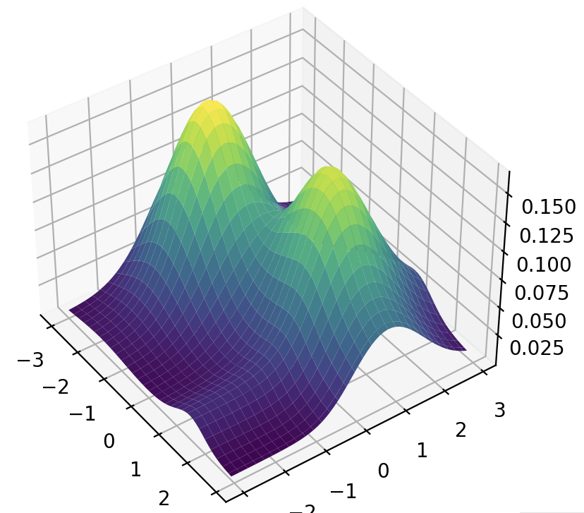
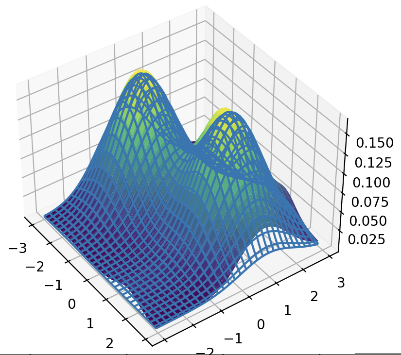

# FINN
A Fixed Integral Neural Network

 

## Description
FINN is a learnable neural network of any input dimension R^n -> R which is constrained to integrate to a given value over a given interval. This constraint is applied analytically, so the integral is exact (not computed numerically) and guaranteed (it is not enforced by an optimisation objective). By default, the value of the function is constrained to be positive, but this constraint can be disabled if necessary. 

While FINN can be used in many applications, the two most prominent use cases are:
1. Representing probability distributions
2. Applying constraints to other neural networks

Application (1) allows FINN to function as an alternative to Normalising Flows, parameterising arbitrary probability distributions.

Application (2) enables the instant calculation of metrics which include an integral. For example, consider a vector-valued network v = f(x). If we wish to impose the constraint ∫||f(x)||dx = ε, then we can use FINN to separately learn the magnitude m = g(x). Then, we can scale the vector v by the learned magnitude: v' = m / ||v||. This guarantees that the integral of the magnitude of v' over the entire domain equals ε. FINN can also be used to impose an inequality constraint, if instead we wish to enforce ∫||f(x)||dx ≤ ε.
